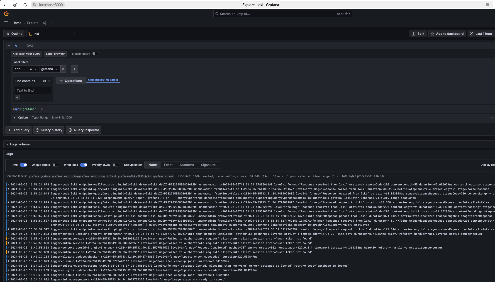

# Описание задания №9
## Что здесь происходит?
Разворачивается инфраструктура в Яндекс.Облоко (k8s-cluster из двух нод + s3-bucket)
В кластер деплоятся сервисы: Grafana (с добавлением датасорса Loki) + Loki (с сохранением данных в s3) + Promtail
Настраивается сбор логов с сервисов кластера через Loki.

## Выполнение задания №9
Инфраструктура разворачивается с помощью [Terraform](https://terraform-provider.yandexcloud.net/).
1. Установить terraform.
2. Инициализировать провайдер yandex-cloud/yandex. 
3. Установить значения для переменных, которые определяют доступ к Yandex.Cloud и путь до публичного ключа(используется для доступа на хосты созданного k8s кластера):
	```bash
	cloud_id        = ""  
	folder_id       = ""  
	token           = ""  
	public_key_path = ""
	```
4. Развернуть инфраструктуру:
```bash
cd terraform/
terraform validate  #проверка конфигурации
terraform plan      #план
terraform apply     #применение
```
5. Подключить созданный кластер в локальный конфиг:
```bash
yc managed-kubernetes cluster get-credentials --external --name tf-k8s --force
```
6. Получить в ENV-переменные ключи доступа к бакету:
```bash
export YC_ACCESS_KEY=$(terraform output -json | jq .access_key.value | sed "s/\"//g")
export YC_SECRET_KEY=$(terraform output -json | jq .secret_key.value | sed "s/\"//g")
```
7. Задеплоить в k8s-кластер сервисы (grafana, loki, promtail):
```bash
# деплоим через helmfile и werf
cd helm/
export WERF_HELM3_MODE=1
helmfile -b werf apply -n monitoring --set loki.storage.s3.accessKeyId=$YC_ACCESS_KEY --set loki.storage.s3.secretAccessKey=$YC_SECRET_KEY
```
8. Получить логин и пароль для графаны
```bash
kubectl get secret --namespace monitoring grafana -o jsonpath="{.data.admin-user}" | base64 --decode ; echo
kubectl get secret --namespace monitoring grafana -o jsonpath="{.data.admin-password}" | base64 --decode ; echo
```
9. Проверка работоспособности:
Проброс портов (доступ до UI графаны)
```bash
kubectl --namespace monitoring port-forward service/grafana 3000:80
```
Открыть в браузере URL http://127.0.0.1:3000/


Для инфраструктурной ноды/нод добавьте taint, запрещающий на нее планирование подов с посторонней нагрузкой -
node-role=infra:NoSchedule

## Вывод команд

```bash
# kubectl get node -o wide --show-labels
NAME      STATUS   ROLES    AGE     VERSION   INTERNAL-IP   EXTERNAL-IP       OS-IMAGE             KERNEL-VERSION      CONTAINER-RUNTIME     LABELS
infra-2   Ready    <none>   14m     v1.28.2   10.10.0.28    130.193.39.61     Ubuntu 20.04.6 LTS   5.4.0-174-generic   containerd://1.6.28   beta.kubernetes.io/arch=amd64,beta.kubernetes.io/instance-type=standard-v1,beta.kubernetes.io/os=linux,failure-domain.beta.kubernetes.io/zone=ru-central1-a,kubernetes.io/arch=amd64,kubernetes.io/hostname=infra-2,kubernetes.io/os=linux,node-role.kubernetes.io=infra,node.kubernetes.io/instance-type=standard-v1,node.kubernetes.io/kube-proxy-ds-ready=true,node.kubernetes.io/masq-agent-ds-ready=true,node.kubernetes.io/node-problem-detector-ds-ready=true,topology.kubernetes.io/zone=ru-central1-a,yandex.cloud/node-group-id=cat2grlqtur8f7ot36df,yandex.cloud/pci-topology=k8s,yandex.cloud/preemptible=false
work-2    Ready    <none>   9m59s   v1.28.2   10.10.0.4     178.154.220.249   Ubuntu 20.04.6 LTS   5.4.0-174-generic   containerd://1.6.28   beta.kubernetes.io/arch=amd64,beta.kubernetes.io/instance-type=standard-v1,beta.kubernetes.io/os=linux,failure-domain.beta.kubernetes.io/zone=ru-central1-a,kubernetes.io/arch=amd64,kubernetes.io/hostname=work-2,kubernetes.io/os=linux,node-role.kubernetes.io=work,node.kubernetes.io/instance-type=standard-v1,node.kubernetes.io/kube-proxy-ds-ready=true,node.kubernetes.io/masq-agent-ds-ready=true,node.kubernetes.io/node-problem-detector-ds-ready=true,topology.kubernetes.io/zone=ru-central1-a,yandex.cloud/node-group-id=catrn5cj8ugl71akn7cc,yandex.cloud/pci-topology=k8s,yandex.cloud/preemptible=false

# kubectl get nodes -o custom-columns=NAME:.metadata.name,TAINTS:.spec.taints 
NAME      TAINTS
infra-2   [map[effect:NoSchedule key:node-role value:infra]]
work-2    <none>
```

## Скриншот
<p align="center">
  
</p>